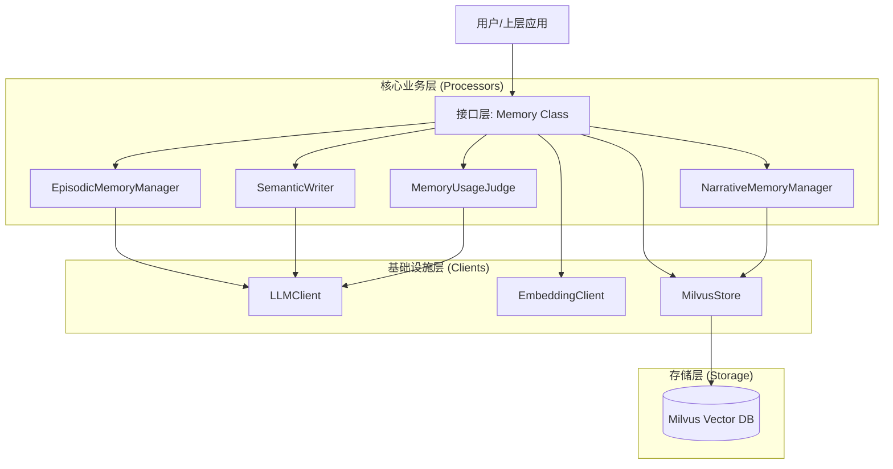
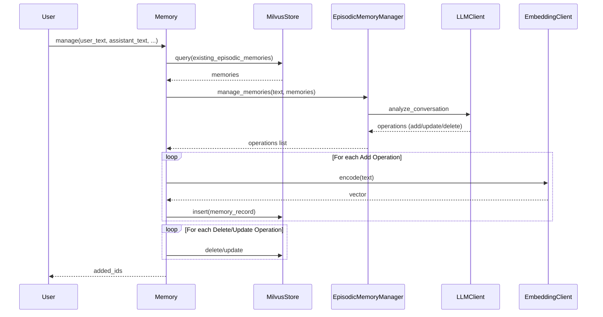
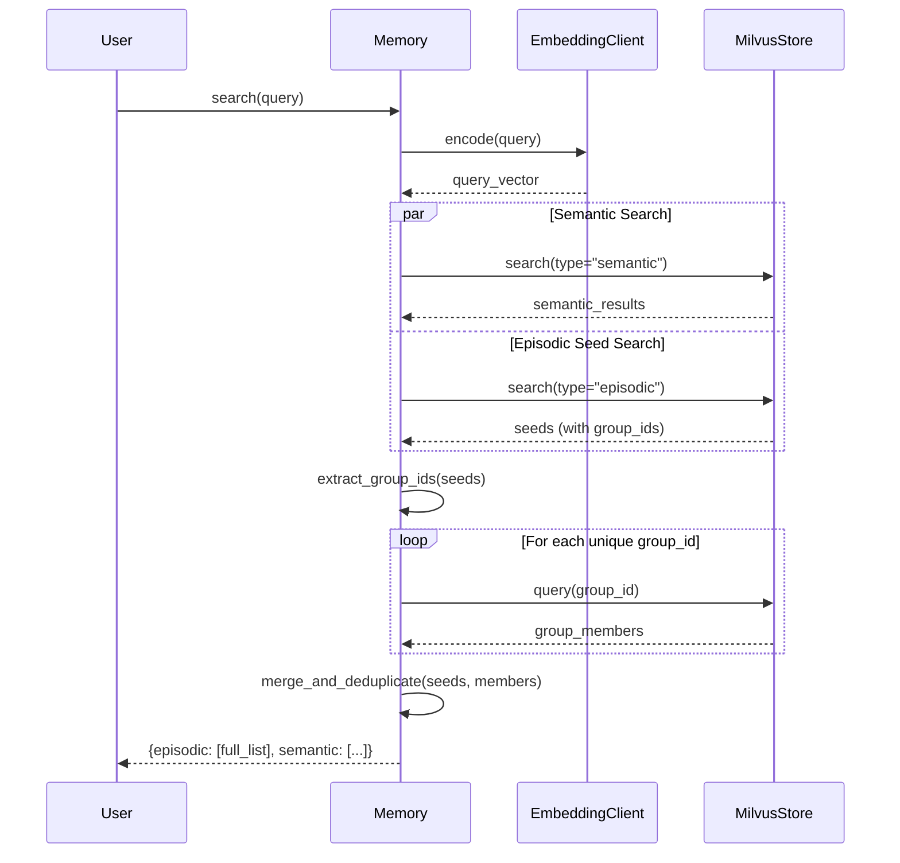

# NeuraMem 项目总结文档
**该文件创建于FastAPI层构建前，FastAPI层只是在Memory层上多加了一层，对底层逻辑没有影响**
## 1. 项目架构 (Project Architecture)

### 1.1 目录结构 (Directory Structure)

项目主要遵循清晰的分层架构，源代码位于 `src` 目录下，测试位于 `tests` 目录下，演示应用位于 `demo` 目录。

```
NeuraMem/
├── AGENTS.md                  # 代理相关文档
├── demo/                      # 演示应用
│   └── app.py                 # Gradio/Web 演示入口
├── src/                       # 核心源码
│   └── memory_system/         # 记忆系统核心包
│       ├── clients/           # 基础设施客户端层
│       │   ├── embedding.py   # Embedding 客户端
│       │   ├── llm.py         # LLM 客户端
│       │   └── milvus_store.py# Milvus 向量存储客户端
│       ├── processors/        # 业务逻辑处理层
│       │   ├── memory_manager.py          # 基础记忆管理
│       │   ├── narrative_memory_manager.py # 叙事性记忆组管理
│       │   ├── semantic_writer.py         # 语义记忆生成
│       │   └── memory_usage_judge.py      # 记忆使用判断
│       ├── utils/             # 工具函数
│       ├── config.py          # 配置管理
│       ├── memory.py          # 核心入口类 (Facade)
│       └── prompts.py         # Prompt 模板管理
└── tests/                     # 测试代码
    ├── integration/           # 集成测试
    └── properties/            # 属性测试 (Property-based tests)
```

### 1.2 架构层次图 (Architectural Layers)

项目采用分层架构，自顶向下分为接口层、处理层、客户端/基础设施层。



---

## 2. 程序处理流程 (Program Processing Flow)

### 2.1 子流程 1：记忆管理 (Memory Management)
**描述**：
用户输入和助手回复被送入系统。系统首先查询相关的现有情景记忆，然后通过 LLM 分析对话上下文，决定执行添加、更新或删除操作。新记忆会被向量化并存储到 Milvus 中。

**主要步骤**：
1. 接收用户文本、助手文本及元数据。
2. 查询用户现有的情景记忆作为上下文。
3. 调用 `EpisodicMemoryManager` 利用 LLM 分析并生成操作指令（Add/Update/Delete）。
4. 执行具体操作（如 Insert 需先调用 EmbeddingClient 生成向量）。

### 2.2 子流程 1 UML 时序图 (Sequence Diagram)



### 2.3 子流程 2：记忆检索与叙事扩展 (Search with Narrative Expansion)
**描述**：
用户进行查询时，系统首先进行语义搜索。对于情景记忆，系统不仅检索最相似的记忆（种子），还会根据这些种子的 [group_id](file:///e:/code/NeuraMem/src/memory_system/clients/milvus_store.py#451-488) 自动扩展检索同一叙事组中的其他记忆，从而提供更完整的上下文。

**主要步骤**：
1. 对查询文本生成向量。
2. 并行检索语义记忆和情景记忆（种子）。
3. 提取情景记忆种子的 [group_id](file:///e:/code/NeuraMem/src/memory_system/clients/milvus_store.py#451-488)。
4. 对有效的组 ID，查询组内的所有成员记忆。
5. 合并种子记忆和扩展成员记忆，去重后返回。

### 2.4 子流程 2 UML 时序图 (Sequence Diagram)



### 2.5 子流程 3：记忆整合 (Consolidation)
**描述**：
这是一个后台批处理流程，用于从大量散碎的情景记忆中提取长期稳定的语义事实。

**主要步骤**：
1. 批量拉取情景记忆和现有的语义记忆。
2. `SemanticWriter` 调用 LLM 进行模式识别和事实提取。
3. 将提取出的新事实生成向量并存储为新的语义记忆。

---

## 3. 各模块详细说明 (Module Details)

### 3.1 接口层
*   **Memory ([src/memory_system/memory.py](file:///e:/code/NeuraMem/src/memory_system/memory.py))**: 系统的核心门面类（Facade）。统一封装了所有底层复杂性，向外提供简单易用的 API（`add`, [search](file:///e:/code/NeuraMem/src/memory_system/memory.py#288-433), [delete](file:///e:/code/NeuraMem/src/memory_system/memory.py#562-593), [reset](file:///e:/code/NeuraMem/src/memory_system/memory.py#594-611), [manage](file:///e:/code/NeuraMem/src/memory_system/memory.py#157-187)）。负责协调各 Manager 和 Client 的工作。

### 3.2 核心业务层 (Processors)
*   **EpisodicMemoryManager ([src/memory_system/processors/memory_manager.py](file:///e:/code/NeuraMem/src/memory_system/processors/memory_manager.py))**: 负责处理短期的情景记忆逻辑。它利用 LLM 判断当前的对话是否值得记录，以及如何更新旧的记忆。
*   **NarrativeMemoryManager ([src/memory_system/processors/narrative_memory_manager.py](file:///e:/code/NeuraMem/src/memory_system/processors/narrative_memory_manager.py))**: 负责叙事性记忆的高级管理，特别是记忆的分组（Clustering）和组维护。它确保相关的记忆被组织在一起。
*   **SemanticWriter ([src/memory_system/processors/semantic_writer.py](file:///e:/code/NeuraMem/src/memory_system/processors/semantic_writer.py))**: 负责从情景记忆中提炼语义记忆（Facts）。它通过分析记忆模式来实现“从经历中学习”。
*   **MemoryUsageJudge ([src/memory_system/processors/memory_usage_judge.py](file:///e:/code/NeuraMem/src/memory_system/processors/memory_usage_judge.py))**: 负责在检索后判断哪些记忆对当前上下文实际有用，用于反馈循环或叙事组分配。

### 3.3 基础设施层 (Clients)
*   **MilvusStore ([src/memory_system/clients/milvus_store.py](file:///e:/code/NeuraMem/src/memory_system/clients/milvus_store.py))**: 它是对 Milvus 向量数据库的封装。负责具体的 Schema 定义、连接管理、CRUD 操作以及向量检索。它处理了两个集合：主记忆集合和用户分组集合。
*   **LLMClient ([src/memory_system/clients/llm.py](file:///e:/code/NeuraMem/src/memory_system/clients/llm.py))**: 封装了与大模型（如 DeepSeek, OpenAI）的交互。处理重试、Fallback 逻辑和 API 调用。
*   **EmbeddingClient ([src/memory_system/clients/embedding.py](file:///e:/code/NeuraMem/src/memory_system/clients/embedding.py))**: 封装了 Embedding 模型的调用，将文本转换为向量。

---

## 4. 数据模型 (Data Model)

项目主要使用 Milvus 向量数据库，包含两个核心 Schema。

### 4.1 主记忆集合 (Memories Collection)
用于存储所有的情景记忆和语义记忆。

| 字段名 (Field) | 类型 (Type) | 说明 (Description) |
| :--- | :--- | :--- |
| [id](file:///e:/code/NeuraMem/src/memory_system/memory.py#614-680) | INT64 | 主键，自动生成 |
| [user_id](file:///e:/code/NeuraMem/tests/properties/test_memory_props.py#16-23) | VARCHAR(128) | 用户标识 |
| [memory_type](file:///e:/code/NeuraMem/tests/properties/test_memory_props.py#189-261) | VARCHAR(32) | 类型："episodic" 或 "semantic" |
| [ts](file:///e:/code/NeuraMem/src/memory_system/memory.py#49-54) | INT64 | 创建时间戳 (Unix Timestamp) |
| [chat_id](file:///e:/code/NeuraMem/tests/properties/test_memory_props.py#25-32) | VARCHAR(128) | 所属的会话/线程 ID |
| [text](file:///e:/code/NeuraMem/tests/properties/test_memory_props.py#34-64) | VARCHAR(65535) | 记忆文本内容 |
| `vector` | FLOAT_VECTOR(2560) | 文本的 Embedding 向量 |
| [group_id](file:///e:/code/NeuraMem/src/memory_system/clients/milvus_store.py#451-488) | INT64 | 叙事组 ID，-1 表示未分组 |

### 4.2 叙事组集合 (Groups Collection)
用于存储叙事组的质心信息，每个用户独立命名 (`groups_{user_id}`)。

| 字段名 (Field) | 类型 (Type) | 说明 (Description) |
| :--- | :--- | :--- |
| [group_id](file:///e:/code/NeuraMem/src/memory_system/clients/milvus_store.py#451-488) | INT64 | 主键，自动生成（与主表 group_id 关联） |
| [user_id](file:///e:/code/NeuraMem/tests/properties/test_memory_props.py#16-23) | VARCHAR(128) | 用户标识 |
| `centroid_vector` | FLOAT_VECTOR(2560) | 该组所有记忆的中心向量 |
| `size` | INT64 | 组内成员数量 |

---

## 5. 测试 (Testing)

项目包含完善的测试体系，主要分为两类：

### 5.1 属性测试 (Property-based Tests)
位于 `tests/properties/`，使用 Hypothesis 库生成随机数据进行测试，验证系统的不变性（Invariants）。

*   **Episodic Memory Field Completeness**: 验证所有存入的情景记忆都包含完整的必要字段（Requirement 2.3）。对应的文件：`tests/properties/test_memory_props.py`。
*   **Search Result Type Coverage**: 验证搜索结果必须包含用户已有的情景和语义记忆（Requirement 3.2）。
*   **Search Result Limit Enforcement**: 验证搜索结果的数量严格遵守配置的 `limit` 参数（Requirement 3.3）。
*   **Reset Operation Completeness**: 验证 `reset` 操作后，该用户的所有记忆数量严格归零（Requirement 8.5）。

### 5.2 集成测试 (Integration Tests)
位于 `tests/integration/`，验证完整的工作流。

*   **Full Flow Test (`tests/integration/test_full_flow.py`)**: 模拟一个完整的用户交互周期，包括：
    1.  初始化系统。
    2.  `manage`: 存储对话记忆。
    3.  `search`: 检索记忆并验证内容。
    4.  `consolidate`: 触发记忆整合。
    5.  `delete/reset`: 清理数据。
    这验证了各个模块（Manager, Client, Store）协同工作的正确性。
